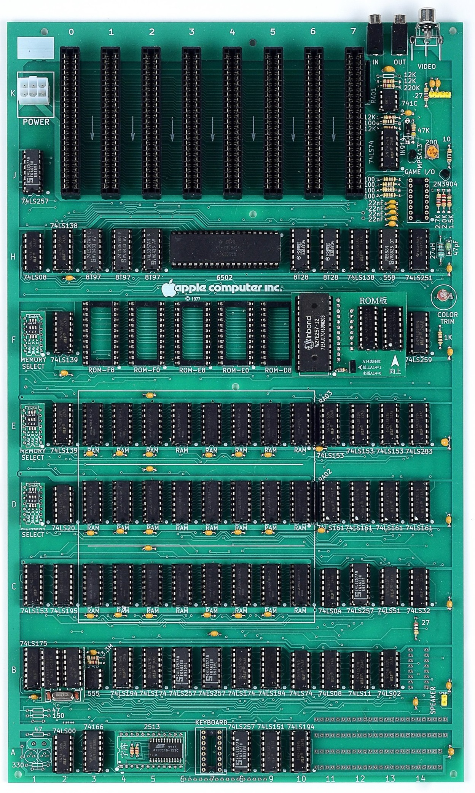
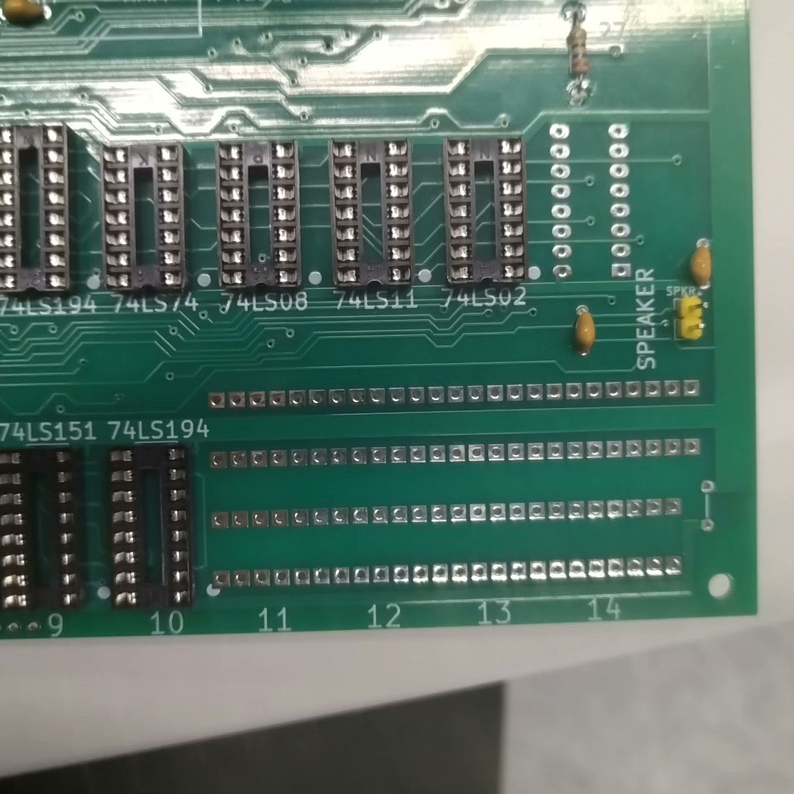
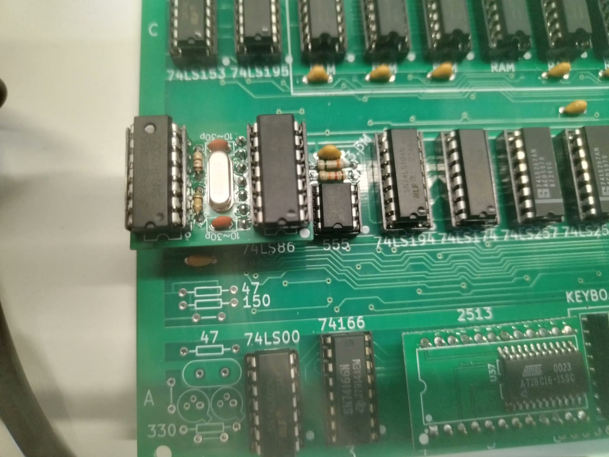
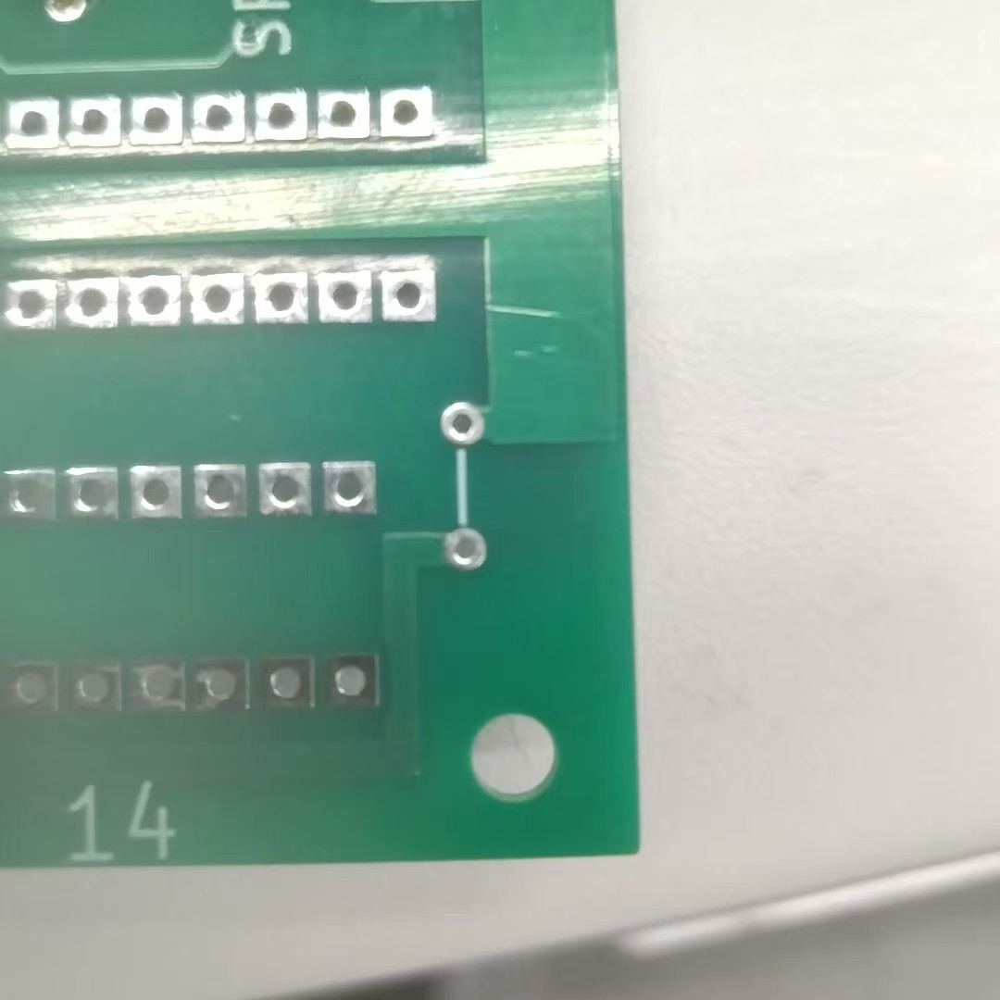
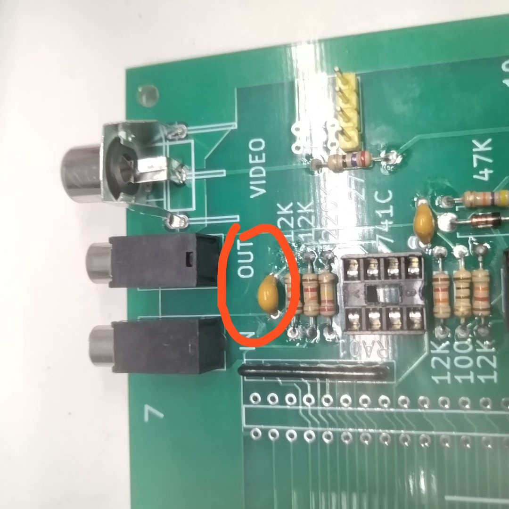
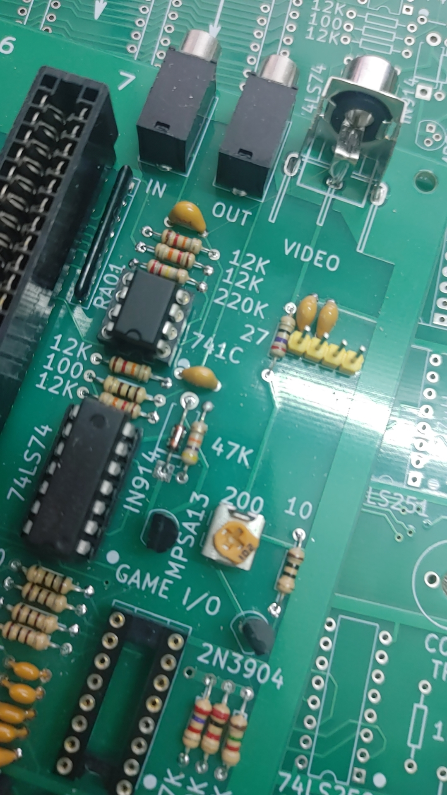
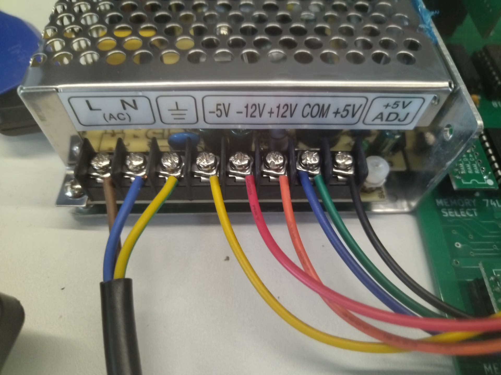
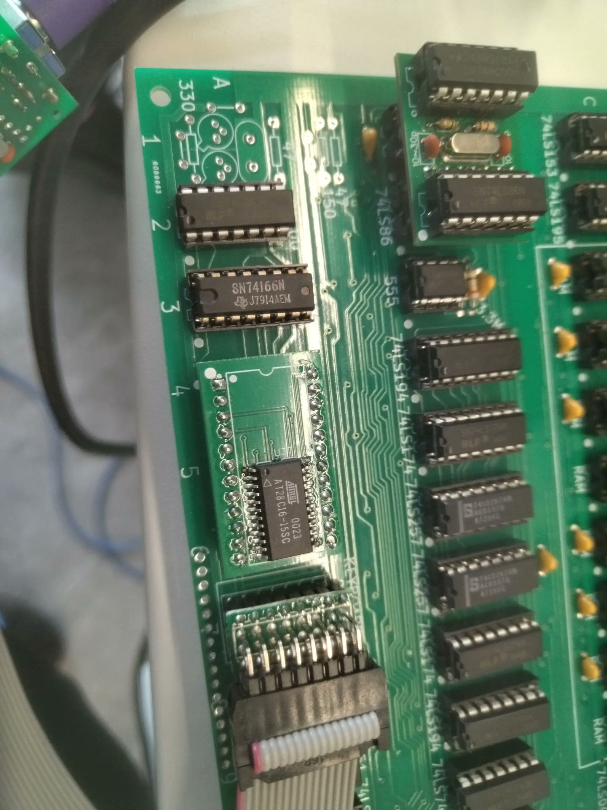

# Apple II Rev 0 Motherboard Replica  
# Apple II Rev 0 主板复刻项目

A faithful reproduction of the original Apple II Rev 0 motherboard, designed for vintage computing enthusiasts, collectors, educators, and hardware builders. This project is intended to save builders the hardest parts of an Apple II Rev 0 build: sourcing rare chips, validating old parts, and debugging unknown component failures.  
这是对 Apple II 最初 Rev 0 主板的忠实复刻，专为复古计算机爱好者、收藏家、教育者和硬件制作者打造。这个项目的目标是帮你省掉 Rev 0 复刻中最耗时、风险最高的部分：寻找稀缺芯片、验证旧器件、排查未知芯片故障。

## ✅ Build Confidence First  
## ✅ 先建立装配信心

- ✅ All critical vintage/used ICs included with the kit are tested before shipment.  
  ✅ 套件中关键 vintage/used IC 发货前都会经过测试。
- ✅ Complete BOM and curated parts are included, so you do not need to hunt rare chips one by one.  
  ✅ 提供完整 BOM 和整理好的元件配置，不需要自己逐个寻找稀缺芯片。
- ✅ Tested replacement circuits and adapter boards are included where original parts are scarce or unreliable.  
  ✅ 对于难买或不稳定的原始器件，套件包含已经验证的替代电路和转接板方案。
- ✅ Detailed assembly notes, photos, and reference material are provided in this repository.  
  ✅ 本仓库提供详细装配说明、照片和参考资料。
- ✅ Support is available if you have questions during assembly or first bring-up.  
  ✅ 如果装配或首次调试时有问题，可以联系支持。
- ✅ A fully assembled and tested version is available for buyers who prefer a ready-built board.  
  ✅ 如果不想自行焊接，也可以选择已经装配并测试完成的版本。

---

## 📦 Project Description  
## 📦 项目简介

This project aims to replicate the Apple II Rev 0 motherboard as faithfully as practical while accounting for modern sourcing limits. Original Apple II parts are increasingly scarce, so the project uses a combination of reproduction PCB work, tested vintage components, compatible substitute circuits, and documented adapter boards.  
该项目旨在尽可能还原 Apple II Rev 0 主板设计，同时兼顾今天的元件采购现实。原始 Apple II 器件越来越稀缺，因此本项目结合了复刻 PCB、经过测试的 vintage 元件、兼容替代电路以及有文档说明的转接板方案。

The technical notes below are included to help you assemble and operate the board safely. They are not meant to make the project feel risky; they document the exact checks that reduce risk.  
下面的技术注意事项是为了帮助你安全装配和使用主板。它们不是为了增加风险感，而是把降低风险所需的检查步骤明确写出来。

---

## 📋 Pre-Soldering Checklist  
## 📋 焊接前检查事项

- ✅ Before soldering, do a quick component count. Some passive components may include extras, but **ICs are exact**.  
  ✅ 焊接前请先简单清点元器件，**芯片数量正好**，部分被动元件会多配一些。
- ✅ All components in 1977 were through-hole; **no surface-mount parts**.  
  ✅ （1977年的主板）全部为插件元器件，无贴片元件。
- ✅ Recommended soldering order:  
  推荐的焊接顺序如下：

电阻 → 二极管 → 电感 → 电容 → 三极管 → IC 座 → 接口端子 → 50针插槽
Resistors → Diodes → Inductors → Capacitors → Transistors → IC Sockets → Connectors → Slot Pins

---

## ⚠️ Power Safety Note — Please Read Before Use  
## ⚠️ 上电安全说明 — 使用前请阅读

### Do NOT power on, power off, or reboot the motherboard by plugging or unplugging the DC output of the power adapter.  
### 禁止通过插拔电源适配器的 DC 端来为主板上电、断电或重启。

Doing so can create high-voltage spikes that may damage RAM chips and other components. Power control should be done only from the AC side of the power supply.  
使用 DC 端插拔通电可能产生瞬间高压尖峰，损坏内存芯片及其他器件。请只通过电源的 AC 端进行开关机或重启操作。

### ✅ Correct method (safe):  
- Switch ON/OFF from **AC input**  
- Use power strip switch / wall socket switch  
- Control power only at the **AC side**

### ❌ Wrong method (dangerous):  
- ❌ 插拔 DC 插头  
- ❌ 依靠 DC 端反复接触重启  
- ❌ 通过 DC 输出做任何形式的通断电  
→ **这些行为都会导致严重损坏！**

---

## ⚠️ Assembly Precautions  
## ⚠️ 装配注意事项

- 🔍 **Always double-check** chip orientation and wiring **before power-on**, especially the first time or after re-seating.  
通电前（尤其首次或重新插拔组件后）请**反复确认芯片方向和接线正确**，否则极易造成芯片损坏。

- 🧊 On first boot, all ICs should be **cool to the touch**. Only memory and CPU may warm up slightly during operation.  
上电初期所有芯片应为凉的，运行一段时间后只有内存块和 CPU 会稍有温度，其他芯片应始终保持凉爽。

---

## 🧩 Special Chip & Socket Instructions  
## 🧩 特殊芯片与插座说明

- 🔄 **Chip Substitutions**  
部分芯片已经替代，请注意以下内容：
- `H3`, `H4`, `H5`: Original **8T97** replaced by **74LS367**  
  原 8T97 被 74LS367 替代
- **Only the two 257 chips near the keyboard connector remain 257s; the other three are replaced with 157s.**  
  仅键盘接口附近的两个 257 芯片使用原型号，其余三个 257 全部使用 157 替代
- `F11`, `F12`: Replaced by **ROM adapter boards**, others can be left empty  
  使用 ROM 替代板插接，其他 ROM 可悬空
- `B2`: 74LS86 uses **oscillator adapter board**  
  74LS86 使用时钟小板替代原电路
- `D1`, `E1`, `F1`: Memory select uses plug-in sub-boards  
  Memory Select IC 使用插接小板
- `A5`: Character ROM uses adapter board  
  字符库 ROM 也插接替代板

- 🔄 **Sockets**  
- IC sockets `A5 dip24`, `A5 dip16`, `J14 dip16`: recommend using **round-hole sockets**  
  建议使用圆孔IC座
- All other positions: use **flat-leg sockets**  
  其他建议使用扁脚座

- 📎 **Watch for socket orientation** (notch direction). Almost all ICs are oriented **downward** when the board is upright.  
注意IC座缺口方向，正常情况下，板正置时所有IC（除横放）均朝下。

- 🔌 **Pin headers and resistive arrays** must be oriented correctly. The **square pad** indicates the start position.  
排阻注意方向，焊盘方形端为起始方向，与小点标记对应。

---

## ⏱️ Clock Circuit Notes  
## ⏱️ 时钟电路说明

The original Apple II oscillator circuit (shown below) is not to be soldered. Modern crystals are incompatible. Clock is provided via an adapter module with 74LS86.

---

## 🔍 Component ID Guide  
## 🔍 元件识别说明

- Most capacitors and resistors are clearly marked.  
电容、电阻等均有清晰标识。
- For unlabeled white outline capacitors, solder **104 ceramic capacitors**.  
无标注但有白线框图的焊接104。

- The red circle one is 224 capacitors**
红色圈出的电容焊接224

- Diodes may be substituted with **common small-signal diodes**.  
二极管可用普通小信号二极管替代。

---

## 🔌 Power Supply & Connection Instructions  
## 🔌 电源说明与接线

1. ⚡ **Switching power supply** conforms to Chinese standard. Confirm voltage labels and **verify DC output with a multimeter** before connecting.  
 随机电源为中国标准，AC接口不同，请仔细核对标签与万用表检测输出电压是否准确。
2. 📏 **Power terminal orientation**: bump side **faces upward**. Incorrect connection will cause **irreversible damage**.  
 接线时电源端子突起一侧向上，接错会严重烧毁器件。
3. 🧯 After full connection, recheck every pin and direction before applying power.  
 所有接线完成后，请再次确认方向与引脚无误再通电。

---

## ⌨️ Keyboard Converter & Boot Behavior  
## ⌨️ 键盘与启动说明

- Keyboard converter cable **must be connected correctly** — **reversed = damage**.  
键盘转换器接线方向错误会烧毁，请特别注意方向。

- When a floppy disk controller card is inserted, the system **boots automatically from virtual floppy**.  
插入软驱卡后会自动从虚拟软驱启动。
- If no floppy controller is present, press `Ctrl + Backspace` to boot into onboard BASIC.  
若拔出软驱卡，开机后请手动按下 Ctrl + 退格键 启动主板内置 BASIC。

---

## 🕹️ Virtual Drive Contents  
## 🕹️ 虚拟软驱内容说明

The root directory contains test tools and **Apple DOS 3.3**.  
The `game` directory contains demo and playable vintage games.

根目录包含测试工具与 Apple DOS 3.3 系统，`game` 文件夹为演示与复古游戏合集。

---

For questions, discussion, or contributions, feel free to open an issue or pull request.  
如有问题、建议或希望贡献内容，欢迎提交 Issue 或 Pull Request。
